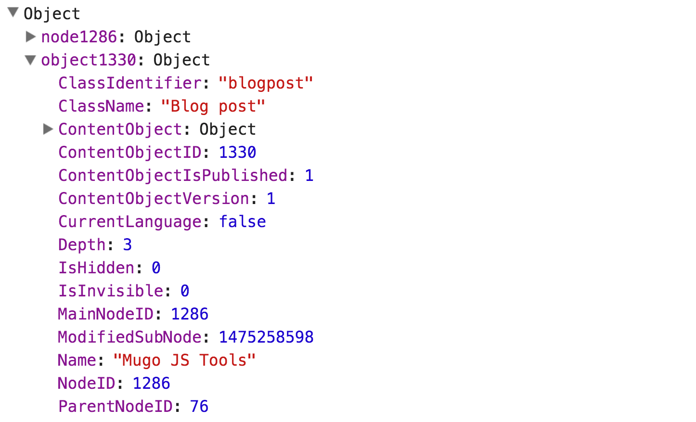
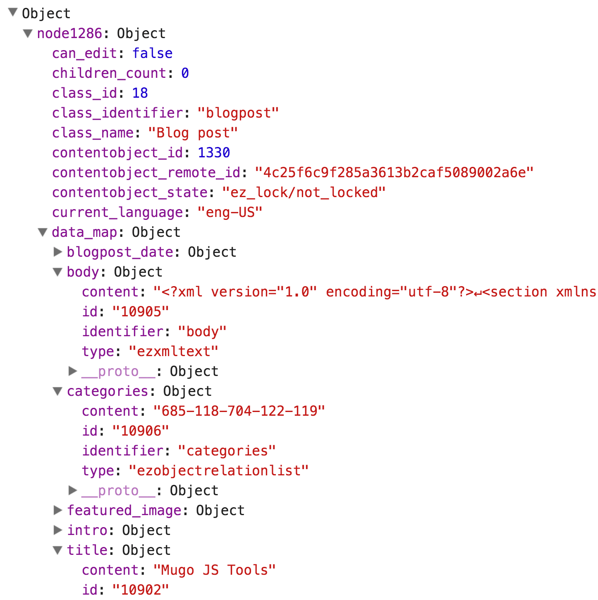

mugojstools
===========
This extension provides JavaScript template operators for eZ Publish template files.

Installation
============
* Clone to your `extensions/` directory
* Activate in `site.ini.append.php`: `ActiveExtensions[]=mugojstools`

Included Operators & Usage
==========================
### {mjs_console_log()}

#### This operator generates a JavaScript console.log() dump in the browser console. Requires [ezjscore](https://github.com/ezsystems/ezjscore).

##### Screenshots:   
   



##### Usage:   
You can pass (or pipe) a string
```php
{mjs_console_log("Foo!")}
```
a variable,
```php
{def $foo="Bar!"}
{mjs_console_log($foo)}
```
 a hash or object,
```php
{def $foo=fetch( 'user', 'current_user' )}
{mjs_console_log($foo)}
```
or a node (complete with data_map):
```php
{def $foo = fetch( 'content', 'node', hash(
    'node_id', 123
))}
{mjs_console_log($foo)}
```

Contributors
============
* Mo Ismailzai ([mo@mugo.ca](mailto:mo@mugo.ca))
* Ernesto Buenrostro ([ernesto@mugo.ca](mailto:ernesto@mugo.ca))

License
=======
MIT License. Copyright (C) 2016 [Mugo Web](http://www.mugo.ca).
